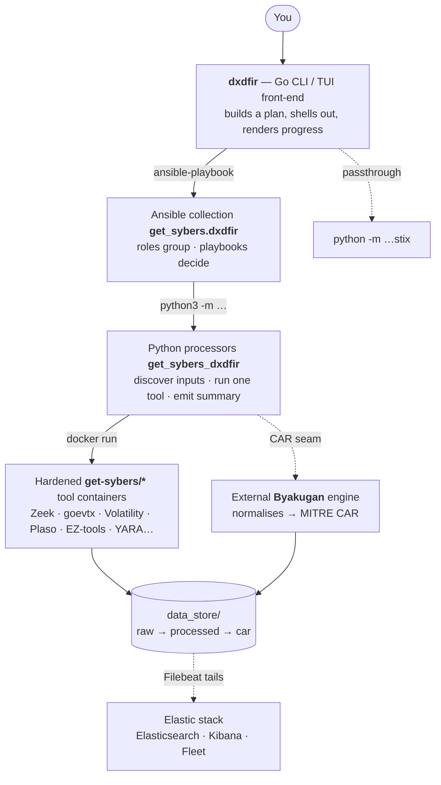

# Architecture overview

DX_DFIR is a **strictly layered** system: each layer owns one concern and delegates
downward. As a user you drive the top; underneath, a Go front-end orchestrates an
Ansible collection, which runs Python processors, which run hardened tool containers.
Nothing skips a layer.

## The layers



## Who does what — and what they don't

| Layer | Owns | Explicitly does **not** |
|---|---|---|
| **Go CLI / TUI** (`go/`) | Build a run plan, drive `ansible-playbook` / `python`, render the [live UI](../getting-started/the-interface.md) by watching output files land | No processing, no `docker run`, no CAR logic (the one native re-port is the [collection registry](processing-lanes.md#collections) reads) |
| **Ansible** (`ansible/`) | *Roles group; playbooks decide.* Assert inputs, build the processor argv, gate on the result | No idempotence in `when:` — that lives in the processor |
| **Python** (`python/`) | Discover inputs, run one tool, emit a `{processed, skipped, failed}` summary | No orchestration or scheduling |
| **Containers** (`docker/`) | Run one hardened tool over one input | Nothing else — fixed non-root user, no network, read-only rootfs |
| **[Byakugan](https://github.com/Get-Sybers/byakugan)** (external) | Normalise processed evidence into MITRE CAR | Lives outside the repo entirely — a pinned sibling checkout, never vendored |
| **[Elastic stack](the-stack.md)** (`docker/elastic/`) | Ingest, search, detect | A separate data plane — it reads the files the pipeline writes; neither drives the other |

The call chain in one line: **you → `dxdfir` → `ansible-playbook` → `python3 -m
get_sybers_dxdfir.<lane>` → `docker run get-sybers/<tool>` → deterministic output files.**
The Go CLI reconstructs progress by *watching those files land*, because Ansible buffers
a lane's stdout until it exits.

## The data lifecycle

Everything is file-driven, so any stage can be inspected on disk:

```
raw ──process──▶ processed ──build-car──▶ car ──car-timeline──▶ timeline.jsonl
 │                   │                      │                          │
 │ data_store/raw/   │ data_store/          │ data_store/processed/    │  (also read live in
 │ <type>/           │ processed/<leaf>/    │ car/<source>/            │   the Timeline tab)
 │                   │                      │  car.db + car_<obj>.jsonl │
 └───────────────────┴──────── Filebeat tails processed/ ──▶ logs-dxdfir.* data streams
```

1. **raw** — evidence staged under `data_store/raw/<type>/` (or a
   [collection](processing-lanes.md#collections)).
2. **processed** — each [lane](processing-lanes.md) writes deterministic per-item output
   plus a JSON summary the lane verifies and the UI watches.
3. **car** — [`build-car`](car-pipeline.md) materialises per-source CAR stores via the
   Byakugan engine.
4. **timeline** — [`car-timeline`](car-pipeline.md#timeline) unions object events +
   relationship edges into one time-ordered stream.
5. **elastic** — [Filebeat](the-stack.md) ships processed evidence into
   `logs-dxdfir.<type>-*` data streams; detections run there.

## Read next

- **[Setup flow](setup-flow.md)** — how a host is provisioned.
- **[Processing lanes](processing-lanes.md)** — the six lanes in detail.
- **[CAR pipeline](car-pipeline.md)** — normalisation, verification, timeline.
- **[The stack](the-stack.md)** — Elasticsearch, Kibana, detections, STIX.
- **[Repository map](../reference/repository-map.md)** — the Get-Sybers repos this is built on.
