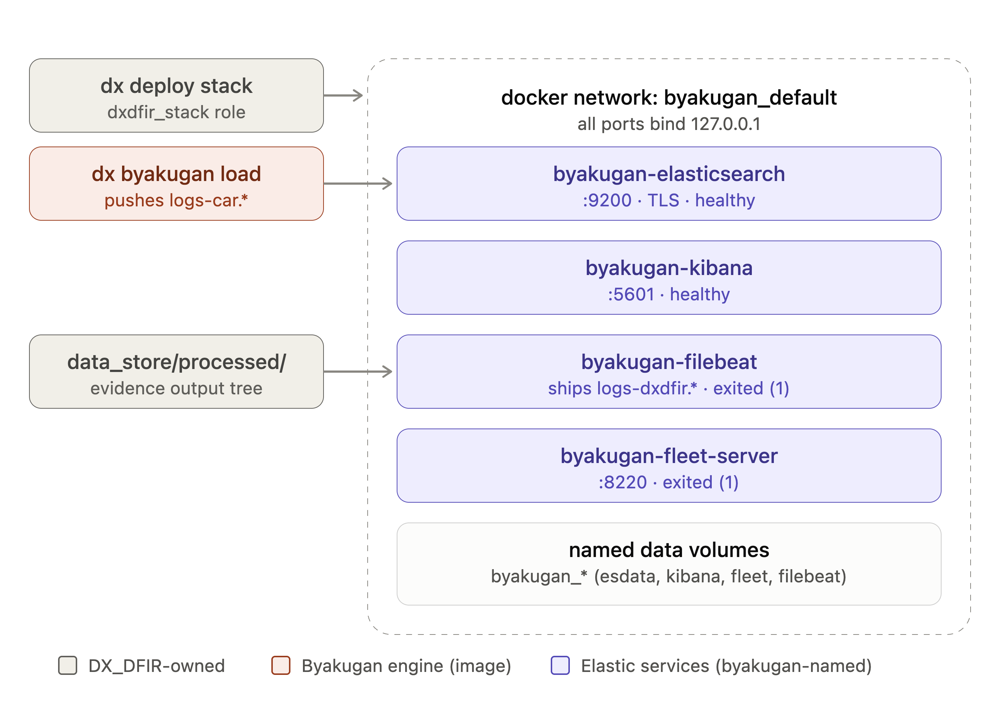

# DFIR Suite Logical Architecture

Oct 8, 2026 · @Jake Badoino

## Overview

The nine repositories form one evidence-processing pipeline. Grouped by the three layers:

1. **Processing engine** — three Go binaries that parse evidence into record files: [gowindowlicker](https://github.com/Get-Sybers/gowindowlicker) (Windows artefacts), [godaemonhunter](https://github.com/Get-Sybers/godaemonhunter) (Linux and macOS artefacts), [anamnesis](https://github.com/Get-Sybers/Anamnesis) (memory images). They build on three libraries: [gopinfo](https://github.com/Get-Sybers/gopinfo) (the shared Go module), [gomount](https://github.com/Get-Sybers/gomount) (disk-image reader), [gomemprocfs](https://github.com/Get-Sybers/gomemprocfs) (MemProcFS bindings).
2. **Relationship engine** — [byakugan](https://github.com/Get-Sybers/Byakugan). It reads the engines' output, maps it to MITRE CAR objects, writes the relationships between those objects, and loads the result into Elasticsearch.
3. **Infrastructure and deployment** — [godfir-toolz](https://github.com/Get-Sybers/GoDFIR-toolz) builds the container images and ships the Ansible roles that run them; [dx\_dfir](https://github.com/Get-Sybers/DX_DFIR) is the operator-facing pipeline: the `dx` CLI, the evidence store, the playbooks and the Elastic stack deployment.

Every statement below is taken from the repositories' own files — `go.mod`, Dockerfiles, `contract.yml`, the Ansible collections and READMEs — as cloned on 2026-10-08.

## Architecture diagram

Arrows inside layer 1 are build-time dependencies: `go.mod` requires (solid) and the gomount binary the Dockerfiles copy into the gowindowlicker and godaemonhunter images (dashed). The three arrows between the bands are files: `dx process` runs each engine over `data_store/raw`, byakugan reads what the engines wrote under `data_store/processed`, and byakugan `load` writes into the Elasticsearch that the `dxdfir_stack` role deployed.

## Layers and responsibilities

### 1 · Processing engine

Three Go binaries, each shipped as one container image, each parsing one evidence domain. All three read an input directory, write one output folder per item and print one JSON summary line (the container framework described in godfir-toolz `docs/framework/`).

- **gowindowlicker** — the Windows artefact parsers `goprefetch`, `goese`, `gorb`, `gomft`, `goamcache`, `goappcompat`, `goevtx`, `gore`, `gosbe`, `gole`, `gojle` and `gowxt` as sub-tools of one static binary; `lick` (the default) runs all of them over an evidence tree. With `GOWINDOWLICKER_IMAGE` set it runs on a disk image: the bundled gomount pulls each parser's artefact set out of the OS volume into the work directory first. Output: `<OUT_DIR>/<subtool>/<item>/<subtool>.jsonl`.
- **godaemonhunter** — the Linux and macOS parsers as sub-tools of one static binary, run in two layers. Layer 1 (`gohost`, `gousers`, `gonetwork`, `gomachost`, `gomacusers`) builds the image's knowledge store (hostname, machine-id, timezone, uid/gid names, mounts); Layer 2 (`gojournal`, `goauditd`, `gowtmp`, `gosyslog`, `gounit`, `gocron`, `goshell`, `gotrash`, `goctl`, `golaunchd`) runs with that store and writes records with resolved names beside the native values. A run can be scoped to a *stream* — a byakugan model word: `authentication`, `user_session`, `process`, `service`, `flow`, `file`, `module`. Also bundles gomount for disk images. Output: per-sub-tool `.jsonl` plus a `knowledge/` directory.
- **anamnesis** — memory-image collectors on MemProcFS (through gomemprocfs; no Volatility). Each collector maps to one CAR object: processes, threads, modules, network flows, file handles, process access, sessions, services, drivers, filescan, MFT scan, malfind, plus image info. Output per image: `plugins/<plugin>.jsonl` and `car.db` (SQLite); the CLI can also write `timeline.json` or one CSV per CAR object. Its image ships the MemProcFS `vmm.so` and `leechcore.so`.

The libraries they build on:

- **gopinfo** — the shared Go module, standard library only. Packages: `framework`, `batch`, `record`, `diskimage`, `discover`, `knowledge`, `plist`, `families`, `tarstream`, `tstamp`, `toolkit`, `report`. gowindowlicker imports `framework`, `tstamp`, `diskimage`; godaemonhunter imports `record`, `batch`, `tstamp`, `discover`, `knowledge`, `plist`, `diskimage`, `families`, `tarstream`; gomount imports `framework`, `tstamp`. `diskimage` is the package that execs the gomount binary (`gomount materialise`).
- **gomount** — reads a disk image's volumes read-only, in userspace, without mounting. Image containers: E01/Ex01, raw, VMDK, VHDX, VHD, QCOW2, VDI, DMG, sparseimage. Filesystems: NTFS, ext2/3/4, XFS, vfat, APFS, HFS+. Verbs: `ls`, `cat`, `stat`, `tree`, `browse`, `identify`, `stream`, `materialise`, `timeline`, and an optional read-only NTFS `mount` over FUSE. It imports gopinfo. It is not a Go dependency of the engines: their Dockerfiles `go install` it and copy the binary to `/usr/local/bin/gomount`.
- **gomemprocfs** — Go bindings to the MemProcFS `vmm` library through purego (no CGo). No get-sybers dependencies; among these repos only anamnesis uses it.

Plaso, Zeek and the signatures lane (YARA, Suricata, Hayabusa) are not in these repositories; godfir-toolz builds their images and run roles alongside the Go engines.

### 2 · Relationship engine

- **byakugan** — a Go parse engine (`go/cmd/byakugan-parse`; no get-sybers imports) plus the Python package that runs it: routing, enrichment, the relationship cascade and the CLI. Sub-tools: `build` maps each processed source to MITRE CAR objects and writes `car_<object>.jsonl` (13 objects) and `car_relationships.jsonl`; `verify` is the correctness gate; `timeline` writes one time-ordered JSONL; `load` bulk-loads a CAR tree into the `logs-car.*` Elasticsearch data streams; `car-vocab` prints the action vocabulary. The source maps in `sources/` cover evtx, Plaso/log2timeline, Zeek, SRUM, prefetch, registry batches, jump lists and memory; an anamnesis `car.db` is read directly. The detection rules in `rules/` are copied into its image at `/rules`; STIX export lives in `byakugan.exchange`.

### 3 · Infrastructure and deployment

- **godfir-toolz** — builds the container images and ships the Ansible that runs them. `images.yml` lists every image: gowindowlicker, godaemonhunter, gomount, anamnesis, byakugan, plaso, zeek, signatures. Each tool directory holds a Dockerfile, a `contract.yml` (environment variables, mounts, exit codes, output layout) and a README; the Go tools are `go install`-ed from their published modules at build time, byakugan is cloned at `BYAKUGAN_REF`, anamnesis at `ANAMNESIS_REF`. Only `signatures` and `zeek` still have Go source in this repo. Two Ansible collections: `get_sybers.godfir_build` (the `godfir_build` role builds and verifies every image in `images.yml`) and `get_sybers.godfir_run` (`godfir_anamnesis`, `godfir_byakugan`, `godfir_godaemonhunter`, `godfir_gowindowlicker`, `godfir_plaso`, `godfir_signatures`, `godfir_zeek`, `godfir_images`, `godfir_run`). Hardening: `hardening/harden.yml`, `USER 2000:2000`, the `/etc/dfir-hardened` declaration; the Go parser images are `FROM scratch`.
- **dx\_dfir** — the operator-facing pipeline. The `dx` CLI (Go, `go/cmd/dx`) runs playbooks from the `get_sybers.dxdfir` collection; its lanes are `zeek`, `gowindowlicker`, `godaemonhunter`, `anamnesis`, `plaso` and `signatures`. The collection's own roles are `dxdfir_evidence`, `dxdfir_images`, `dxdfir_stack`, `dxdfir_car_load`, `dxdfir_export`, `dxdfir_exchange` and `dxdfir_cleanup`; the `dxdfir-process-<tool>`, `dxdfir-build-car` and `dxdfir-car-timeline` playbooks import the `get_sybers.godfir_run` roles (pinned to GoDFIR-toolz v0.2.2 in `requirements.yml`). Evidence lives under `data_store/raw/` (pcaps, logs, disk\_images, VM\_files, memory, filesystem, mobile, other\_raw\_data) and outputs under `data_store/processed/<tool>/`, with CAR under `processed/byakugan/<source>/`. `dxdfir_stack` deploys Elasticsearch, Kibana, Elastic Agent (Fleet) and Filebeat from `docker.elastic.co` images on 127.0.0.1, generating the TLS material and secrets.

## Data flow and dependencies

A case run, in the order the `dx` commands execute:

1. Evidence is copied into `data_store/raw/sort/<case>/`; `dx register <case>` lane-sorts it by content, SHA-1 hashes it and writes a registry row.
2. `dx process <case> [<lane>]` runs one `ansible-playbook` per lane. Each `dxdfir-process-<tool>` playbook imports that tool's `godfir_run` role, which builds the `docker run` from the tool's `contract.yml` (environment variables and mounts).
3. For a disk image, gowindowlicker and godaemonhunter call the bundled gomount (`gomount materialise`) to pull the artefact set out of the OS volume into the work directory; anamnesis opens a memory image through gomemprocfs/MemProcFS.
4. Outputs land under `data_store/processed/`: `windowlicker/…/<subtool>.jsonl`, `daemonhunter/…/<subtool>.jsonl` plus `knowledge/<host>/`, `anamnesis/…/<image>/` (plugin JSONL + `car.db`), `log2timeline/…/timeline.jsonl`, `zeek/…/`, `detections/…`.
5. `dx byakugan build` runs the byakugan container over that tree and writes `processed/byakugan/<source>/car_<object>.jsonl` + `car_relationships.jsonl`; `dx byakugan verify` gates the result; `dx byakugan export-timeline` writes one time-ordered JSONL.
6. `dx deploy stack` brings up Elasticsearch, Kibana, Fleet and Filebeat on 127.0.0.1. Filebeat tails the processed tree into `logs-dxdfir.<type>-*` data streams; `dx byakugan load` (the `dxdfir_car_load` role) bulk-loads the CAR tree into `logs-car.*`.
7. Detection rules — shipped in the byakugan image at `/rules` — run as ES|QL/EQL rules in Elastic's Detection Engine; `dx byakugan export-stix` turns their hits into STIX 2.1 through the engine's exchange module.

Where the repositories depend on each other, and where that is declared:

| From | To | Declared in |
| --- | --- | --- |
| gowindowlicker | gopinfo v0.2.1 | `go.mod` require |
| godaemonhunter | gopinfo v0.2.1 | `go.mod` require |
| gomount | gopinfo v0.2.1 | `go.mod` require |
| anamnesis | gomemprocfs v0.2.0 | `go.mod` require |
| gowindowlicker, godaemonhunter | gomount v0.2.1 | their Dockerfiles in godfir-toolz `go install` it and copy the binary; `gopinfo/diskimage` execs it |
| godaemonhunter | byakugan | stream names are byakugan model words (README; `BYAKUGAN_REF` pin) |
| byakugan | the engines | files only: it reads the processed tree; no Go import in either direction |
| byakugan | Elasticsearch | `load` bulk-loads into `logs-car.*` |
| godfir-toolz | the tool repos | Dockerfiles pin gowindowlicker, godaemonhunter and gomount at v0.2.1, anamnesis at `ANAMNESIS_REF`, byakugan at `BYAKUGAN_REF` |
| dx\_dfir | godfir-toolz | `requirements.yml`: `get_sybers.godfir_run` from GoDFIR-toolz v0.2.2; the playbooks import its roles |

Neither byakugan's Go engine nor the `dx` CLI imports any get-sybers Go module (their `go.mod` files).

## Repository quick reference

| Repository | Layer | Responsibility | Shape |
| --- | --- | --- | --- |
| [gopinfo](https://github.com/Get-Sybers/gopinfo) | 1 · library | Shared Go module: framework/batch runtime, record envelope, input discovery, disk-image materialise (execs gomount), knowledge store, timestamps | Go module, standard library only |
| [gomount](https://github.com/Get-Sybers/gomount) | 1 · library | Reads disk images and their filesystems in userspace: `identify`, `stream`, `materialise`, `timeline`, `ls`/`cat`/`stat`/`tree`/`browse` | Go binary; its own image in godfir-toolz |
| [gomemprocfs](https://github.com/Get-Sybers/gomemprocfs) | 1 · library | Go bindings to MemProcFS (purego, no CGo) | Go module |
| [gowindowlicker](https://github.com/Get-Sybers/gowindowlicker) | 1 · engine | 12 Windows artefact parsers in one binary → per-sub-tool JSONL | Go binary; `FROM scratch` image |
| [godaemonhunter](https://github.com/Get-Sybers/godaemonhunter) | 1 · engine | Linux/macOS: Layer 1 knowledge store, Layer 2 daemon parsers → per-sub-tool JSONL | Go binary; `FROM scratch` image |
| [anamnesis](https://github.com/Get-Sybers/Anamnesis) | 1 · engine | Memory image → per-collector JSONL + `car.db` | Go binary; Debian-slim image with the MemProcFS libraries |
| [byakugan](https://github.com/Get-Sybers/Byakugan) | 2 | Processed sources → CAR objects + relationships; `verify`; `timeline`; `load` into `logs-car.*` | Go parse engine + Python package; image |
| [godfir-toolz](https://github.com/Get-Sybers/GoDFIR-toolz) | 3 | Dockerfiles and `images.yml` for all eight images; the `godfir_build` and `godfir_run` Ansible collections; the hardening playbook | Dockerfiles, Ansible, shell scripts |
| [dx\_dfir](https://github.com/Get-Sybers/DX_DFIR) | 3 | The `dx` CLI, the `dxdfir` collection and playbooks, `data_store`, the Elastic stack deployment | Go CLI + Ansible collection |

Sources: each repository's `README.md`, `go.mod`, `contract.yml` and Dockerfile, `ansible_collections/` in godfir-toolz and `ansible/collections/` in dx\_dfir, as cloned on 2026-10-08.
