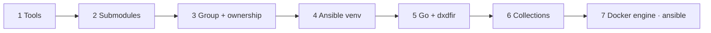

# Setup flow

`scripts/setup-environment.sh` provisions an online host in guarded, idempotent
steps. Each is safe to re-run; a step that finds its work already done reports and moves
on. (The older prose walkthrough is [Setup_Environment.md](../scripts/Setup_Environment.md);
the source is the best reference.)

| # | Step | What it provisions |
|---|---|---|
| 1 | **Userland tools** | `ca-certificates curl git gnupg unzip python3 python3-venv tar` (only what is missing). |
| 2 | **Git submodules** | `submodule update --init --recursive` — [anamnesis](https://github.com/Get-Sybers/Anamnesis) (memory lane) and [GoDFIR-toolz](https://github.com/Get-Sybers/GoDFIR-toolz) (the tool images). |
| 3 | **Docker group + ownership** | The `docker` group is pre-created when absent (`groupadd --system docker` — docker itself only arrives at step 7, but the chown needs the group NOW on a fresh host), then `chown -R <user>:docker` + `chmod -R u=rwX,g=rX,o=` over the checkout (capital `X` keeps dirs traversable for the group). |
| 4 | **Ansible (pinned)** | Create the repo's own `.venv` (gitignored, as the invoking user — no sudo, `$DXDFIR_VENV` overrides), `pip install -r requirements.txt` (ansible-core + the docker SDK the collection's modules import — no host python package). `dxdfir` resolves this venv by relation to the checkout, so nothing needs it on PATH; an earlier release's `/opt/dxdfir/venv` is retired. |
| 5 | **Go + dxdfir** | Install the pinned, SHA-256-verified Go toolchain (if absent/too old), build the `dxdfir` binary unprivileged from a clean ephemeral cache, install it as a real file at `/usr/local/bin/dxdfir` (on every default PATH, sudo's `secure_path` included — nothing to re-login for) plus the man page, retire an earlier release's `/opt/dxdfir/bin/dxdfir` and any legacy `/usr/local/bin` symlink shims, then write ONE managed `/etc/profile.d/dxdfir.sh` (mode 0644) as a login-shell convenience: the pinned Go and the venv bin appended, so system python/pip keep winning. |
| 6 | **Ansible collections** | `ansible-galaxy install` the collection's pinned `requirements.yml` into `/opt/dxdfir/collections`. The GoDFIR-toolz **build galaxy** installs NOTHING on the primary path: its roles resolve in place from the submodule (`docker/GoDFIR-toolz/roles` on the repo-root `roles_path`) at the gitlink pin; only a checkout without the submodule has it imported by `ansible-galaxy` from the `.gitmodules` source at the gitlink revision, into the shared path `roles_path` also covers as its degraded-only last entry. |
| 7 | **Docker engine (ansible)** | `dxdfir-bootstrap.yml` — engine, daemon and the invoking user's docker-group membership, one implementation shared with the deploy. The script invokes the venv's `ansible-playbook` by ABSOLUTE path: sudo's `secure_path` never carries the venv, so a bare `sudo ansible-playbook` is command-not-found on exactly the fresh host this step exists for. |
| 8 | **Proof** | From a fresh non-login shell with the default PATH (`env -i bash -c …`): `command -v dxdfir` must resolve to the installed file, and the landing dashboard's `ansible` readiness line must be `[ok]` — the script fails here rather than report a success the operator's next shell would contradict. The docker group is the one thing that still needs a new shell, and only when the membership is newer than the running one; the script detects that case and says `newgrp docker` or re-login. |

> The Byakugan CAR engine is **no longer provisioned on the host**. It is cloned + built into the hardened [`get-sybers/byakugan`](https://github.com/Get-Sybers/byakugan) image at the `sources.yml` pin (`docker/GoDFIR-toolz/byakugan/Dockerfile`, parse binary and model sources baked in) by `dxdfir build-docker`, alongside the other tool images — so the CAR lane only shells that image.

## Why these choices

A few guards encode ways an earlier revision failed on a clean machine — they're worth
knowing:

- **`sudo` is resolved once and may be empty.** Minimal container images are often
  already root and carry no `sudo`; hardcoding it died on line one.
- **`--editable` install is required, not a preference.** The Python package resolves
  paths relative to its own files (the `docker/GoDFIR-toolz` submodule — its
  `images.yml` manifest included — and `data_store/`). A copying install would put it under `site-packages` where none of
  those resolve.
- **Capital-`X` permissions.** `u=rwX,g=rX` applies `+x` to directories and to files that
  already carry it — so the `docker` group can traverse the tree and the `.sh` files stay
  runnable, while evidence files stay non-executable.
- **Pinned, verified Go, built clean.** The toolchain tarball is checksum-verified against
  the go.dev release index before extraction, and the build runs from a throwaway module
  cache with `GOTOOLCHAIN=local` so it never silently auto-upgrades or trusts stale
  modules. See [build and test](../reference/build-and-test.md).

## Offline hosts

Air-gapped installs provision connected first, then disconnect: run
`scripts/setup-environment.sh` online (build images, install the toolchain),
save the tarballs with `scripts/save-docker-images.sh`, move/disconnect — a
re-run with no route out falls back to loading those tarballs. See the
[scripts overview](../scripts/Scripts-Overview.md).
