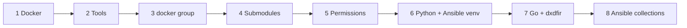

# Setup flow

`scripts/setup-environment.sh` provisions an online host in ten guarded, idempotent
steps. Each is safe to re-run; a step that finds its work already done reports and moves
on. (The older prose walkthrough is [Setup_Environment.md](../scripts/Setup_Environment.md);
the source is the best reference.)

| # | Step | What it provisions |
|---|---|---|
| 1 | **Docker engine** | `docker-ce`/cli/containerd/buildx/compose-plugin from the distro-derived Docker apt repo (skipped if present). |
| 2 | **Userland tools** | `ca-certificates curl git gnupg unzip python3 python3-venv tar`. |
| 3 | **Docker group** | `groupadd docker` + `usermod -aG` the invoking user. |
| 4 | **Git submodules** | `submodule update --init --recursive` — [PIIAT-Mem](https://github.com/Get-Sybers/PIIAT-Mem) (memory lane) and [GoDFIR-toolz](https://github.com/Get-Sybers/GoDFIR-toolz) (EZ-tools). |
| 5 | **Permissions** | `chown -R <user>:docker` + `chmod -R u=rwX,g=rX,o=` (capital `X` keeps dirs traversable for the group). |
| 6 | **Python + Ansible** | Create `/opt/dxdfir/venv`, `pip install --editable python/` against `python/constraints.txt`; symlink `ansible*` onto PATH. |
| 7 | **Go + dxdfir** | Install the pinned, SHA-256-verified Go toolchain (if absent/too old), then build the `dxdfir` binary from a clean ephemeral cache to `/opt/dxdfir/bin`, symlink onto PATH, install the man page. |
| 8 | **Ansible collections** | `ansible-galaxy install` the collection's pinned `requirements.yml` into `/opt/dxdfir/collections`. |

> The Byakugan CAR engine is **no longer provisioned on the host**. It is cloned + built into the hardened [`get-sybers/byakugan`](https://github.com/Get-Sybers/byakugan) image at the `sources.yml` pin (`docker/GoDFIR-toolz/byakugan/Dockerfile`, parse binary and model sources baked in) by `dxdfir build-docker`, alongside the other tool images — so the CAR lane only shells that image.

## Why these choices

A few guards encode ways an earlier revision failed on a clean machine — they're worth
knowing:

- **`sudo` is resolved once and may be empty.** Minimal container images are often
  already root and carry no `sudo`; hardcoding it died on line one.
- **`--editable` install is required, not a preference.** The Python package resolves
  paths relative to its own files (the `docker/GoDFIR-toolz` submodule, `data_store/`,
  `sources.yml`). A copying install would put it under `site-packages` where none of
  those resolve.
- **Capital-`X` permissions.** `u=rwX,g=rX` applies `+x` to directories and to files that
  already carry it — so the `docker` group can traverse the tree and the `.sh` files stay
  runnable, while evidence files stay non-executable.
- **Pinned, verified Go, built clean.** The toolchain tarball is checksum-verified against
  the go.dev release index before extraction, and the build runs from a throwaway module
  cache with `GOTOOLCHAIN=local` so it never silently auto-upgrades or trusts stale
  modules. See [build and test](../reference/build-and-test.md).

## Offline hosts

Air-gapped installs use a two-host flow: `scripts/package-offline.sh --build` (online:
build + bundle everything, images included) → the bundle's `setup-offline.sh`
(offline: install from the bundle). See the
[scripts overview](../scripts/Scripts-Overview.md).
