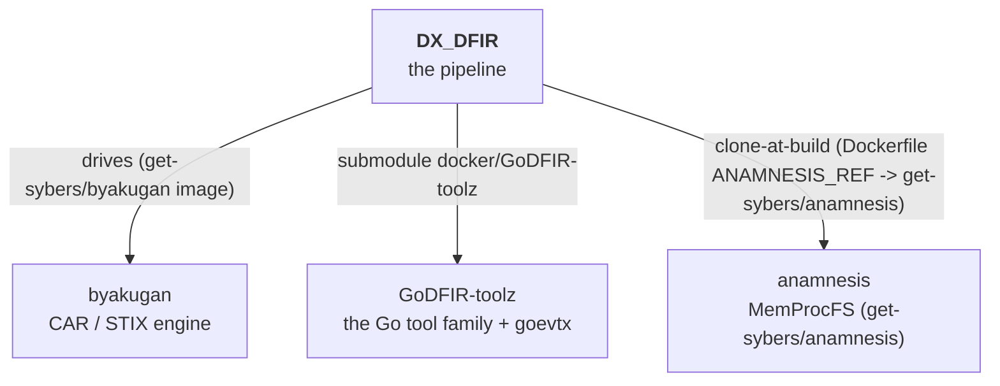

# Repository map

DX_DFIR sits at the centre of a small family of [Get-Sybers](https://github.com/Get-Sybers)
repositories. This is what depends on what, and where each piece lives.

## The Get-Sybers ecosystem

| Repository | Link | How DX_DFIR uses it |
|---|---|---|
| **byakugan** | [Get-Sybers/byakugan](https://github.com/Get-Sybers/byakugan) | The external CAR / STIX engine the [`dxdfir_byakugan` lane](../architecture/car-pipeline.md) drives. **Not vendored, not a host checkout** — it is cloned + built into the hardened `get-sybers/byakugan` image (`docker/GoDFIR-toolz/byakugan/Dockerfile`) at the exact sha pinned by `sources.yml`, by `dxdfir build-docker` (the [image build](../architecture/setup-flow.md)) alongside the other tool images. The lane only shells that image. |
| **GoDFIR-toolz** | [Get-Sybers/GoDFIR-toolz](https://github.com/Get-Sybers/GoDFIR-toolz) | Git submodule at `docker/GoDFIR-toolz`. The source for the static-Go tool family (gore, gomft, goese, goprefetch…), **goevtx** (the `.evtx` parser the [evtx lane](../architecture/processing-lanes.md) runs) and **godaemonhunter** (the Linux daemon-parser matrix — journal, auditd, logins, syslog, units, cron, shells — in one stream-called binary), plus the canonical hardening playbook. |
| **anamnesis** | [Get-Sybers/Anamnesis](https://github.com/Get-Sybers/Anamnesis) | Pure-Go memory-forensics tool (MemProcFS). No longer vendored — cloned + built into the hardened `get-sybers/anamnesis` image (`docker/GoDFIR-toolz/anamnesis/Dockerfile`) at the `sources.yml` pin; the [memory lane](../architecture/processing-lanes.md) docker-runs it. |

## In-repo layout

The full directory map is [Dir-Structure.md](../Dir-Structure.md). The pieces that matter:

| Path | What it is |
|---|---|
| `go/` | The [`dxdfir` Go front-end](go-standards.md) — CLI + TUI. |
| `ansible/collections/get_sybers.dxdfir/` | The [Ansible collection](ansible-standards.md) — roles + playbooks. |
| `docker/` | The GoDFIR-toolz submodule — every hardened tool-image build context AND the image inventory it supplies ([Containers.md](../Containers.md)); the Elastic stack is deployed by the `dxdfir_stack` role ([the stack](../architecture/the-stack.md)). |
| `data_store/` | Evidence lifecycle: `raw/ → processed/ → processed/byakugan/` (git-ignored). |
| `scripts/` | Host provisioning + offline packaging ([overview](../scripts/Scripts-Overview.md)). |
| `.github/tests/` | The [check + smoke harnesses](build-and-test.md). |
| `docker/GoDFIR-toolz/images.yml` | The `get-sybers/*` tool-image inventory (names + build context/dockerfile/args), SUPPLIED by the GoDFIR-toolz submodule at the gitlink pin — the single source of truth the build galaxy (`godfir_build`: build, the runtime `verify` gate, the `audit`) and the `dxdfir_images` role read; this repo carries no image list of its own. |
