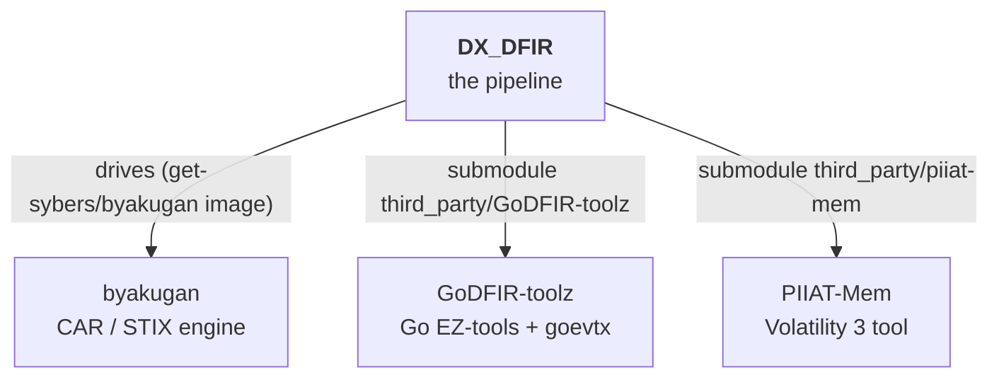

# Repository map

DX_DFIR sits at the centre of a small family of [Get-Sybers](https://github.com/Get-Sybers)
repositories. This is what depends on what, and where each piece lives.

## The Get-Sybers ecosystem

| Repository | Link | How DX_DFIR uses it |
|---|---|---|
| **byakugan** | [Get-Sybers/byakugan](https://github.com/Get-Sybers/byakugan) | The external CAR / STIX engine the [`dxdfir_byakugan` lane](../architecture/car-pipeline.md) drives. **Not vendored, not a host checkout** — it is cloned + built into the hardened `get-sybers/byakugan` image (`docker/byakugan/Dockerfile`) at the exact sha pinned by `byakugan.ref`, by `dxdfir build-docker` (the [image build](../architecture/setup-flow.md)) alongside the other tool images. The lane only shells that image. |
| **GoDFIR-toolz** | [Get-Sybers/GoDFIR-toolz](https://github.com/Get-Sybers/GoDFIR-toolz) | Git submodule at `third_party/GoDFIR-toolz`. The source for the static-Go EZ-tool family (gore, gomft, goese, goprefetch…) and **goevtx** (the EvtxECmd substitute the [evtx lane](../architecture/processing-lanes.md) runs), plus the canonical hardening playbook. |
| **PIIAT-Mem** | [Get-Sybers/PIIAT-Mem](https://github.com/Get-Sybers/PIIAT-Mem) | Git submodule at `third_party/piiat-mem`. The standalone Volatility 3 tool that drives the [memory lane](../architecture/processing-lanes.md). |

### Renamed repositories

You'll see the old names in history and internal git dirs:

- **PIIAT-MitreCar → byakugan** — the CAR engine's repo and its Python package
  (`piiat_mitrecar → byakugan`) were renamed. `docs/research/` and the CHANGELOG
  reference `PIIAT-MitreCar#…` engine PRs.
- **EZTools-Docker → GoDFIR-toolz** — the tool repo was renamed after the Go rewrite; the
  submodule's internal gitdir still carries the old name.

## In-repo layout

The full directory map is [Dir-Structure.md](../Dir-Structure.md). The pieces that matter:

| Path | What it is |
|---|---|
| `go/` | The [`dxdfir` Go front-end](go-standards.md) — CLI + TUI. |
| `python/get_sybers_dxdfir/` | The Python processing package (one module per lane) + `detect/` + `stix/`. |
| `ansible/collections/get_sybers.dxdfir/` | The [Ansible collection](ansible-standards.md) — roles + playbooks. |
| `docker/` | Hardened tool-image Dockerfiles ([Containers.md](../Containers.md)) + `elastic/` ([the stack](../architecture/the-stack.md)). |
| `data_store/` | Evidence lifecycle: `raw/ → processed/ → processed/byakugan/` (git-ignored). |
| `scripts/` | Host provisioning + offline packaging ([overview](../scripts/Scripts-Overview.md)). |
| `tests/` | The [check + smoke harnesses](build-and-test.md). |
| `byakugan.ref` | The pinned Byakugan engine sha. |
| `third_party/` | The submodules above. |
