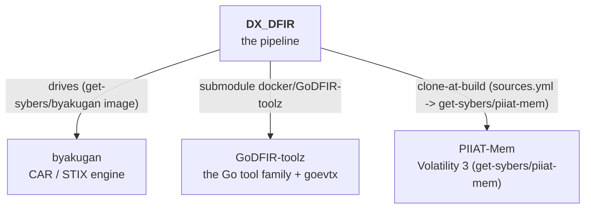

# Repository map

DX_DFIR sits at the centre of a small family of [Get-Sybers](https://github.com/Get-Sybers)
repositories. This is what depends on what, and where each piece lives.

## The Get-Sybers ecosystem

| Repository | Link | How DX_DFIR uses it |
|---|---|---|
| **byakugan** | [Get-Sybers/byakugan](https://github.com/Get-Sybers/byakugan) | The external CAR / STIX engine the [`dxdfir_byakugan` lane](../architecture/car-pipeline.md) drives. **Not vendored, not a host checkout** — it is cloned + built into the hardened `get-sybers/byakugan` image (`docker/GoDFIR-toolz/byakugan/Dockerfile`) at the exact sha pinned by `sources.yml`, by `dxdfir build-docker` (the [image build](../architecture/setup-flow.md)) alongside the other tool images. The lane only shells that image. |
| **GoDFIR-toolz** | [Get-Sybers/GoDFIR-toolz](https://github.com/Get-Sybers/GoDFIR-toolz) | Git submodule at `docker/GoDFIR-toolz`. The source for the static-Go tool family (gore, gomft, goese, goprefetch…) and **goevtx** (the `.evtx` parser the [evtx lane](../architecture/processing-lanes.md) runs), plus the canonical hardening playbook. |
| **PIIAT-Mem** | [Get-Sybers/PIIAT-Mem](https://github.com/Get-Sybers/PIIAT-Mem) | Volatility 3 memory-forensics tool. No longer vendored — cloned + built into the hardened `get-sybers/piiat-mem` image (`docker/GoDFIR-toolz/piiat-mem/Dockerfile`) at the `sources.yml` pin; the [memory lane](../architecture/processing-lanes.md) docker-runs it, and yara's `vadyarascan` too. |

### Renamed repositories

You'll see the old names in history and internal git dirs:

- **PIIAT-MitreCar → byakugan** — the CAR engine's repo and its Python package
  (`piiat_mitrecar → byakugan`) were renamed. `docs/research/` and the CHANGELOG
  reference `PIIAT-MitreCar#…` engine PRs.
- **EZTools-Docker → GoDFIR-toolz** — the tool repo was renamed after the Go rewrite; the
  submodule's internal gitdir still carries the old name.

## In-repo layout

The full directory map is [Dir-Structure.md](../Dir-Structure.md). The pieces that matter:

| Path | What it is |
|---|---|
| `go/` | The [`dxdfir` Go front-end](go-standards.md) — CLI + TUI. |
| `python/get_sybers_dxdfir/` | The Python processing package (one module per lane) + `detect/` + `stix/`. |
| `ansible/collections/get_sybers.dxdfir/` | The [Ansible collection](ansible-standards.md) — roles + playbooks. |
| `docker/` | The GoDFIR-toolz submodule (every hardened tool-image build context, [Containers.md](../Containers.md)) + the `elastic/` compose stack ([the stack](../architecture/the-stack.md)). |
| `data_store/` | Evidence lifecycle: `raw/ → processed/ → processed/byakugan/` (git-ignored). |
| `scripts/` | Host provisioning + offline packaging ([overview](../scripts/Scripts-Overview.md)). |
| `.github/tests/` | The [check + smoke harnesses](build-and-test.md). |
| `sources.yml` | External source pins — the Byakugan engine sha (clone-at-build) + a submodule inventory. |
| `images.yml` | The `get-sybers/*` tool-image inventory (names + build context/dockerfile/args + `ref`→`sources.yml` pin) — the single source of truth both the Python guard (`get_sybers_dxdfir.images`) and the `dxdfir_images` role read. |
